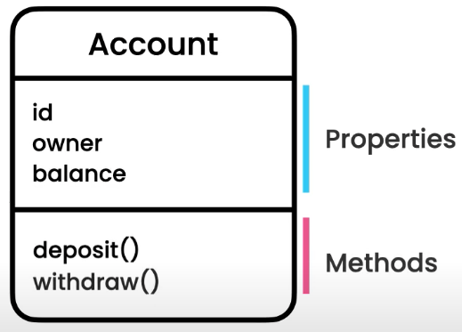
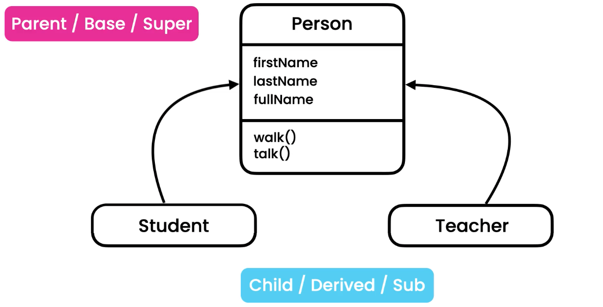
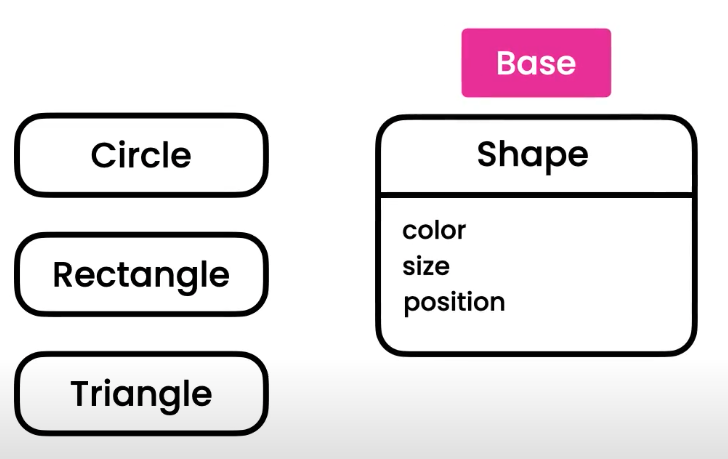

# TypeScript

Typescirpt is a programming language created by Microsoft address some of the shortcomings of javascript. TS is a programming language built on top of the Javascript. So every JS file is TS valid file. TS helps us to build more robust and maintainable applications in less time.

TS has some benefits:
- Static typing
- Code complation
- Refactoring
- Shorthand notations

<strong>Stattic types</strong>

Statically-typed languages such as C++, C# or java, we now the type of variables at compile time or when coding

```java
// Java
int number = 10;
number = "a"; // WRONG
```

Dynamically-typed languages such as JavaScript, Python or Ruby, the type of variable is dynamic. Variables can be changed at runtime.

```javascript
// Javascript
let number = 10;
number = "a"; // It is OK
```

This may leads to create bugs which may be very hard to find it.

TS is sometimes called as javascript with type checking.

```typescript
// Typescript
let x: number = 10;
x = "a" // Compiler will identify the bug! 
```

Drawbacks:
- Compalition - We need to give .ts to typescript compiler to compile and translate into .js => this process is called transpilation
- Discipline in coding

Sum up above, TS is good to use for medium to large projects whereas JS might be better for simple projects.

## Setting Up the Development Environment

1. Install the [Node.js](https://nodejs.org/en/).
2. run `npm i -g typescript`
3. run `tsc -v` to check if we installed the TS correctly.

<strong>Configuring the Typescript Compilier</strong>
- `tsc --init` this create a configuration file `tsconfig.json`


<strong>Debugging the Typescript Applications</strong>
- We need to enable in the emit section the sourceMap feature in tsconfig.json
- When clicking on the debug button, the launch.json is open so add this `"preLaunchTask": "tsc: build - tsconfig.json" ,` right above `"outFiles"`

## Fundamentals

We will introduce in this section as follow:
- The any Type
- Arrays
- Tuples
- Enums
- Functions
- Objects

### Built-in Types

TS add some more types to regular types of JS.

| JavaScript  | TypeScript  |
| ----------- | ----------- |
| number      | any         |
| string      | unknow      |
| boolean     | never       |
| null        | enum        |
| undefined   | tuple       |
| object      |             |

Declaring a primitive types in TS

```Typescript
let sales: number = 123_456_790; // if the number is big, we can use underscore in TS for better reading
let course: string = 'Typescipt';
let isPublish: boolean = true; 
let level; // Type of the variable is any

// if we initialize the variable with string, number etc. we do not have tu use the type
// as it figures out automatically:
let avg = 50; // If we hover over avg it'll show a type number
```

### Any Type
We try to avoid using type `any` as much as possible because we are loosing the benefits of Typescript

```Typescript
let level;
level = 1;
level = 'a';
```
It is valid as the level is type any.

### Arrays

```Typescript
let numbers: number[] = [1, 2, 3]; // again we do not have to explicity mention that
                                   // that is an array of numbers as we initialized
                                   // variable numbers 
```

### Tuples

Tuple is a fixed length of array where each element has a particular type. We often use this when working with a pair of values. Let's say that for each user we want to represent two values - id and name.

```Typescript
let user: [number, string] = [1, "Tom"];
user.push(2); // !! You can use array methods eventhough this should not work as tuple is a fixed length of array!
```

It is better to use a tuple for just two values (pair values). When we use tuple for more than two values it gets a bit unclear and difficult to understand what each value means etc.

### Enums

Enum represents a list of related constants. Let's say we want to represent the size of T shirts as constants.

One way:

```Typescript
const small = 1;
const medium = 2;
const large = 3;
```
or
```Typescript
// PascalCase notation is used for enum
const enum Size {Small = 1, Medium, Large}; // values inside of {} are called members
// Automatically assigned { Small = 0, Medium = 1 ...}
// We can start also with 1 if we assign for the first member only { Small = 1, ...} as we change the order with this.
// We can also use letters instead { Small = 's', Medium = 'm' ...} but we have to explicitly do it for all members

let mySize: Size = Size.Medium;
console.log(mySize) // print out 2
```
*Tip*: Use `const` before `enum` as it will generate more optimized code when the TS compiler comply the code from TS to JS.

### Functions

We should always specify the return value of the function.

```Typescript
function calculateTax(income: number, taxYear = 2022): number {
    if (taxYear < 2022)
        return income * 1.2;
    return income * 1.3;
}
```
We can use optional parametr instead of default value for taxYear like `taxYear?` but it is better to use default parametr to avoid undefined.

### Objects

We can use `readonly` to be able to read a property and not to change it.

```Typescript
let employ: {
    readonly id: number
    name: string
    retire: (date: Date) => void // void represent the return value of the method - we do not expect any value to be returned
} = {
    id: 1,
    name: "Tom",
    retire: (date: Date) => {
        console.log(date);
    }
}
```

This is a bit noisy and difficult to read so later of thistutorial, I'll show you how to do it better.

## Advanced Types
To introduce advanced types in Typescript!

### Type Alias

With `type` we can simplify the object we created above as follow:

```Typescript
type Employe = {
    readonly id: number
    name: string
    retire: (date: Date) => void
}

let employ: Employe = {
    id: 1,
    name: "Tom",
    retire: (date: Date) => {
        console.log(date);
    }
}
```

### Union Types

With `union` we can give to a variable or function one or more types.

```Typescript
function kgToLbs(weight: number | string): number {
    // Narrowing 
    if (typeof weight === 'number')
        return weight * 2.2;
    else
        return parseInt(weight) * 2.2;
}

kgToLbs(10);
kgToLbs('10');
```

The union type is `number | string` and we need to narrowing in the function block to identify if it is number or string.

### Intersection Types

We have another technic to combine types called intersection. Instead of verticle bar we use `&`

`weight: number & string` - this does not make sence as object weight cannot be number and string at the same time so see real example below:

```Typescript
type Draggable = {
    drag: () => void;
}

type Resizable = {
    resize: () => void;
}

type UIWidget = Draggable & Resizable

let textBox: UIWidget = {
    drag: () => {},
    resize: () => {}
}
```

### Literal Types

Sometimes we want to limit a value we can assign to a variable. This is where we use literal types where we specify exact value or we can use union types such as

```Typescript
let quantity: 50 | 100 = 100;

// Or even better, we can use alias type
type Quantity = 50 | 100;
let quiantity: Quantity = 50;
```
It also can be a string, not just number etc.

### Nullable Types

We can use null as a type such:
```Typescript
function greet(name: string | null | undefined)
    if (name)
        console.log(name.toUpperCase());
    else
        console.log("Hola!");

greet(null);
```

### Optional Chaining

```Typescript
type Customer = {
    birthday: Date 
}

function getCustomer(id: number): Customer | null {
    return id === 0 ? null : {birthday: new Date()}
}

let customer = getCustomer(0);
// if (customer !== null && customer !== undefined) // Instead this we can use Optional property access operator with '?'
console.log(customer?.birthday);
```

### The Nullish Coaelscing Operator
The nullish coaelscing operator in Typescript is `??`. This check whether the value is null or undefined;

```Typescript
let speed: number | null = null;
let ride = {
    speed: speed ?? 30 // means use speed if the speed is not null or undefined otherwise use 30
}
```
### Type Assertion
Sometimes we know more about the type of a variable than the TypeScript compiler. In those situations, we can use the as keyword to specify a different type than the one inferred by the compiler. This is called type assertion.

```Typescript
// HTMLElement
// HTMLInputElement
let phone = document.getElementById("phone") as HTMLInputElement;
// or
let phone = <HTMLInputElement> document.getElementById("phone");

phone.value;
```

### The Unknown Type
The unknown type is the type-safe version of any. Similar to any, it can represent any value but we cannot perform any operations on an unknown type without first narrowing to a more specific type.

```Typescript
function render(document: uknown) {
    // Use narrowing when uknown type is used

    if (typeof document === "string"){
        // In this block code, we have string method available
        // typeof can be used just for primitive types. We need to use instanceof for custom objects instead.
    }
    document.move(); // Compiler won't be complaining eventhougt those methods does not exist, because we use type uknown
    document.fly();
}

```

### The Never Type
The never type represents values that never occur. We often use them to annotate functions that never return or always throw an error. 


```Typescript
function reject(message: string): never { // We annotate it with never as this func will never return
    throw new Error(message);
}

reject("...");
console.log("Hello World"); // This will never be executed 
```

## Classes, Interfaces and Object-oriented Programming

In this section we are going to look at:
- Introduction to OOP
- Classes
- Constructors
- Properties and methods
- Access control keyword
- Getters & Setters
- Static members
- Index signature
- Inheritance
- Polymorphism
- Abstract classes
- Interfaces

### What Is OOP
OOP stands for Object-Oriented Programing. OOP is one of the many programming paradigms (styles of programming) in which objects are the building blocks of applications. We have others such as:

- Procedural
- Functional
- Object-oriented
- Event-driven
- Aspect-oriented
and so on ...

TS and JS can be used for functional or OOP style of programming.

The object contain a 

- data (state) also known as properties
- Operations (behaviour) also known as methods

### Creating Classes

OOP is all about object. To create an object, you need to create a class first. A class is a blueprint for creating objects. It is like a object factory.

Let's create a class account as follow:



Every class needs constructor which is a special method inside of the class used for initializing an object. Constructor has no return keyword as it should always return an instance of a bank account. So if we hover over the constructor we can see that the return value is Account.

```Typescript
class Account {
    id: number;
    owner: string;
    balance: number;

    constructor(id: number, owner: string, balance: number) {
        this.id = id;
        this.owner = owner;
        this.balance = balance
    }

    deposite(amount: number): void {
        if (amount <= 0)
            throw new Error("Invalid amount!");
        this.balance += amount;
    }
}
```

### Creating an Object

`new Account()` is a new instance of the Account class

```Typescript
let account = new Account(1, "Tom", 0);
account.deposite(100); 
console.log(account.balance); // print: 100
console.log(account);         // print: Account { id: 1, owner: 'Tom', balance: 100 }
console.log(account instanceof Account); // print: true  - typeof would return object which is not handy.
```

### Read-only and Optional Properties
TS provides modifiers that can be applied to our property and this helps us to write more robust code. We cannot change the id of the accoung when using readonly modifier.

```Typescript
class Account {
    readonly id: number;
    owner: string;
    balance: number;
    nickname?: string; // This is an optional property therefore it does not have to be in the parametr of constructor

    constructor(id: number, owner: string, balance: number) {
        this.id = id;
        this.owner = owner;
        this.balance = balance
    }
```

### Access Control Keywords
TS provide more modifiers for controlling access to properties and methods. We use these modifires to write more robust code.

We hate three access modifier:
- public
- private
- protected

All the properties are public by default.

```Typescript
class Account {
    readonly id: number;
    owner: string;
    private _balance: number; // This property is accessible only inside of the class | we use underscore when the property is private
    nickname?: string;
```

### Parametr Properties
We can simplify our code using parametr properts as follow:

```Typescript
class Account {
    // readonly id: number;
    // owner: string;
    // balance: number;
    nickname?: string; // This is an optional property therefore it does not have to be in the parametr of constructor

    constructor(
        public readonly id: number,
        public owner: string,
        private _balance: number) { // we use underscore when the property is private
        // this.id = id;
        // this.owner = owner;
        // this.balance = balance
    }
```
The compiler will initialize the properties as before but this is much concise.

### Getters & Setters
Getter is a method inside of the class that we use for getting the value of a property. For example for private balance property we can set up getter and setter as follow:

```Typescript
class Account {
    constructor(
        public readonly id: number,
        public owner: string,
        private _balance: number
        ){
        }

    set balance(amount: number) {
        if (amount <= 0)
            throw new Error("Invalid amount!");
        this._balance += amount;
    }

    get balance(): number {
        return this._balance;
    }
}

let account = new Account(1, "Tom", 0);
account.balance = 100;
console.log(account.balance);
```

### Index Signatures
Index signature is used when we need to modify object dynamically. It is possible in JS but not in TS. Therefore we use index signature in this case.

```Javascript
// JS
let person = {}
person.name = "Tom" // works in JS but not in TS
```

```Typescript
// TS
class SeatAssignment {
    // A1, A2, ... we do not want to create like 1000 properties therefore
    // Tom, John, ... 
    // Index signature property
    [seatNumber: string]: string; // last string can be a customer obj
}

let seats = new SeatAssignment();
seats.A1 = "Tom"; // dot notation
// seats["A1"] = "Tom"; // Square bracket notation is also available 
seats.A2 = "John";
seats.A3 = 1; // Gets typing error as it can be only string
```

### Static Members
A static property is a property that belongs to a class and not an object. We are going to have only one instance of that property in memory.

Static members are accessed using the class name. We use them where we need a single instance of a class member (property or method) in memory. 

```Typescript
class Ride {
    private static _activeRiders: number = 0;

    start() { Ride._activeRiders++}
    stop() { Ride._activeRiders--}

    static get activeRiders() { // We need to use stati access modifier to access the static property in the class
        return Ride._activeRiders; // We do not use this as this referes to the object and not a class!!
    }
}

let ride1 = new Ride();
ride1.start();

let ride2 = new Ride();
ride2.start();

console.log(Ride.activeRiders); // Output: 2
```

### Inheritance

Sometimes when dealing with classes that have some commonality. For example student and teacher have some common properties and methods so it is better to create a class called Person as below:



Inheritance is a mechanism that allows us to reuse our code.

Code example:

```Typescript
class Person {
  constructor(public firstName: string, public lastName: string){};

  get fullName() {
    return `${this.firstName} ${this.lastName}`;
  }

  walk() {
    console.log("Walking...");
  }
}

class Student extends Person {
  constructor(public studentId: number, firstName: string, lastName: string) { // note we do not use access modifier for firstName 
    // and lastName as we do not want to create a new properties in Student class hence it already exists in Person class
    super(firstName, lastName);
  }

  takeTest() {
    console.log("Taking a test...")
  }
}

let student = new Student(1, "Tom", "K");
```

### Method Overriding

Overriding method means changing its implementation.

```Typescript
class Teacher extends Person {
  // We do not have to create constructor if we do not want to create additional properties for Teacher class.

  override get fullName() {
    return `Professor ${super.fullName}`; // We can use super keyword to not repeat ourselves. 
  }
}

let teacher = new Teacher("T", "K");
console.log(teacher.fullName); // Output: Professor T K
```

### Polymorphism

Poly = many & morph = form  =>  Many forms - where an object can take many different forms.

```Typescript
printNames([
  new Student(1, "Tom", "K"),
  new Teacher("Joy", "J"),
  new Principal("Dan", "D")
]);

function printNames(people: Person[]): void {
  for (let person of people)
    console.log(person.fullName);
}
// Output:
// Tom K
// Professor Joy J
// Principal Dan D
```
We can see two different output, two different form of class Person. This is the example of polymorphism.

The anoter principle of OOP is 
<strong>Open Closed Principle</strong> says: Classes should be open for extention and closed for modification!

That means that we should not modify class Person but we should add a new form of the class like we add Principal. Ps. this is a guide only as sometimes we need to modify a class.

### Private vs Protected Members

`private` keyword means that the property or method is accessible only inside of the class whereas `protected` is accessible inside of the class and its inhereted to derived classes. Do not use `protected` unless you really know what you are doing.

### Abstract Classes & Methods
An abstract class is a class with partial implementation. Abstract classes cannot be instantiated and have to be inherited. Once we have one abstract method we need to make class abstact too.



```Typescript
abstract class shape {
  constructor(public color: string){}

  abstract render(): void;
}

class circle extends shape {
  constructor(public radius: number, color: string) {
    super(color);
  }

  override render(): void {
    console.log("Rendering a circle!");
  }
}
```

### Interface

We use interfaces to define the shape of objects. We use interface when we do not have any general implementation. If we have, then the abstract class is suitable.

```Typescript
interface Calendar {
    name:string;
    
    addEvent():void; 
}

class GoogleCalendar implements Calendar { }
```

## Generics

- Generic classes
- Generic functions
- Generic interfaces
- Generic constrain
- Type mapping (transforming types)

### Understanding the Problem

Generics allow us to create reusable classes, interfaces and functions.